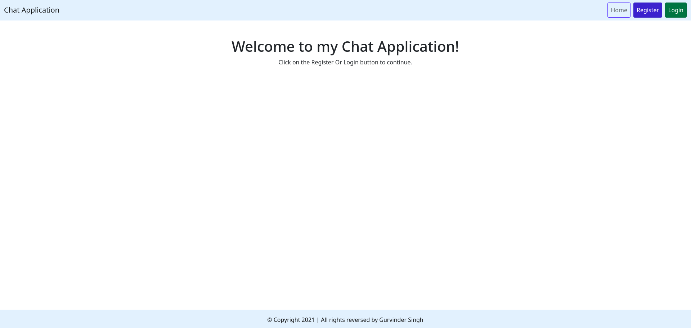
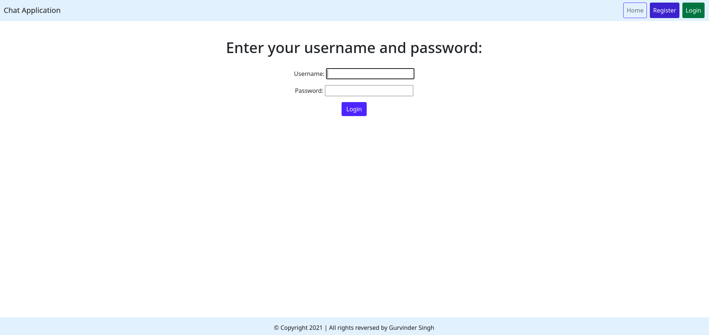
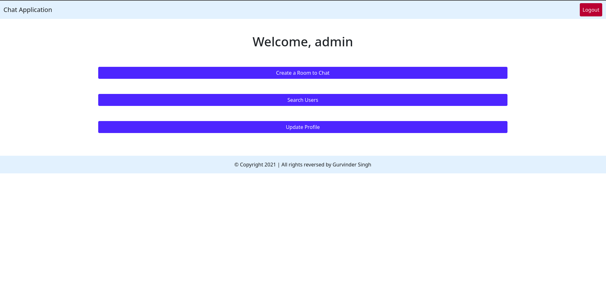
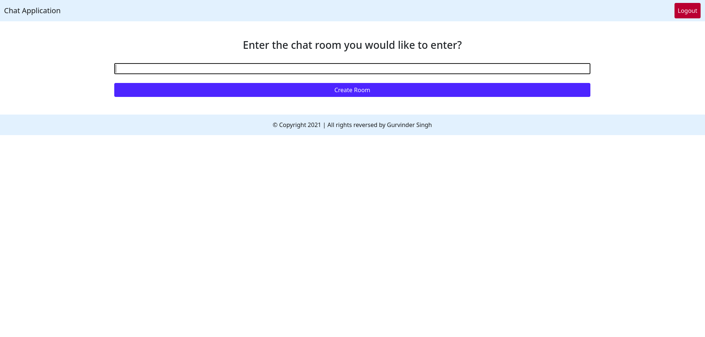

<div>
    <h3 align="center">Ela Chat App</h3>
    <p align="center">
        Ela Chat App facilitates seamless communication by enabling users to send and receive messages effortlessly.
    </p>
</div>

<br />

## Demo

<video width="700" controls>
    <source src="./Videos/Demo.mp4" type="video/mp4">
</video>

<br />

## Screenshots

|||
|-----|-----|
|||

<br />

## Features

- Registration and login features.
- Establish private chat rooms.
- Search for users by username.
- Manage profile information.
- Instantaneous sending and receiving of messages.

<br />

## Built With

[![Python][Python]][Python-url]&nbsp; &nbsp;[![Django][Django]][Django-url]&nbsp; &nbsp;[![Bootstrap][Bootstrap.com]][Bootstrap-url]


<br />

## Getting Started

Follow the below steps in order to step this project on your local machine.

### Prerequisites

- Make sure you have python version **3.9.5** running on your local machine.

- In case you don't have python installed, go to the official website ([Python.org](https://python.org)) and install it.

### Installation

- Clone repository
```
git clone git@github.com:Guri-X/Ela-Chat-App.git
```

- Create a virtual environment
```
cd Ela-Chat-App/
python -m venv env
```

- Activate virtual environment
```
source env/bin/activate
```

- Install requirements from **requirements.txt** file
```
pip install -r requirements.txt
```

- Create **.env** file and add your django **SECRET_KEY**
```
cp .env.sample .env
```

### Execution

- Migrate database
```
python manage.py migrate
```

- Start project at [http://localhost:8000](http://localhost:8000)
```
python manage.py runserver 8000
```

<br />

## Contributing

If you would like to improve this project by adding more features or improving the UI, feel free to create a pull request.

## License

Distributed under the MIT License. See `LICENSE.txt` for more information.

## Contact

:star2: Gurvinder Singh - [@Guri_XD](https://twitter.com/Guri_XD)

:email: Email - guri.developer97@gmail.com

:rocket: Project Repo - [https://github.com/Guri-X/Ela-Chat-App](https://github.com/Guri-X/Ela-Chat-App)

<br />

## References

- https://www.python.org/
- https://www.djangoproject.com/
- https://getbootstrap.com/
- https://channels.readthedocs.io/en/latest/

[Python]: https://img.shields.io/badge/python-FFE467?style=for-the-badge&logo=python&logoColor=blue
[Python-url]: https://www.python.org/
[Django]: https://img.shields.io/badge/django-163F2E?style=for-the-badge&logo=django&logoColor=white
[Django-url]: https://www.djangoproject.com/
[Bootstrap.com]: https://img.shields.io/badge/Bootstrap-563D7C?style=for-the-badge&logo=bootstrap&logoColor=white
[Bootstrap-url]: https://getbootstrap.com